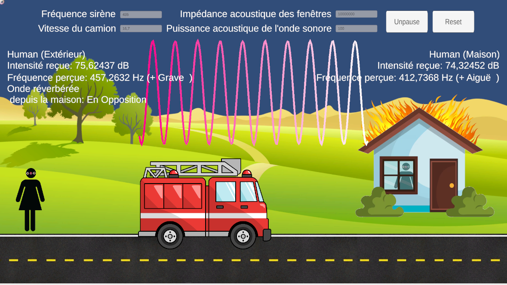
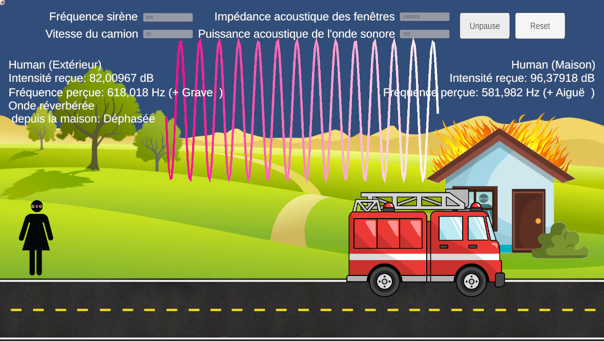

# TP Ondes Sonore

## Objectifs

L'objectif de ce TP est de mettre en pratique les phénomènes acoustiques tels que la 
propagation sonore, la réflexion, l’interférence, et l’effet Doppler.

## Étude
### Niveau sonore (Question 6 du TP)

~~~
Seuls les paramètres d'impédance de la fenêtre (et de l'air, constant dans notre modèle) et de la puissance de la source influe sur le volume perçu (le volume varie évidemment avec la distance).
Les paramètres de fréquence de la source et de vitesse du véhicule (par effet Doppler), feront varier la fréquence perçue.
~~~
### Interférence (Question 8 du TP)
~~~
Avec le déplacement du véhicule, l'onde réfléchie sur la fenêtre entre en phase et en opposition de phase régulièrement.
C'est logique, puisque la distance entre la source et la fenêtre devient périodiquement un multiple de la longueur d'onde.
~~~
## Features

Choix de :
- la fréquence de la sirène du camion de pompiers en Hz
- la vitesse du camion en m.Hz
- la puissance acoustique de l’onde sonore en W
- l’impédance acoustique des fenêtres de la maison en Pa.s/m

Affichage de :
- la fréquence perçue par chacun des observateurs
- la phase de l'onde incidente avec celle réverberée par la fenêtre, perçues par l'observateur extérieur
- l'intensité reçue de la sirène par chacun des observateurs
- l'onde sinusoïdale perçue par l'habitant (ralentie 100x par rapport à la réalité)

## Précisions

Les constantes utilisées :
- Impédance de l'air à 440 Pa.s/m
- Vitesse du son à 343 m/s

Valeurs conseillées :
- Impédance du verre de 10^7 à 1,4.10^7 Pa.s/m
- Impédance de la pierre de 7,5.10^7 Pa.s/m
- Frequence de siréne usuelle de 435 à 488 Hz
- Vitesse de base à 60 km/h (16,7 m/s)

Approximations :
- ON NE NÉGLIGE PAS LA VITESSE DU VEHICULE POUR L'EFFET DOPPLER
- La phase a une tolérence de 10% pour une visualisation facile 
- A 50cm du camion on néglige l'effet Doppler (à l'instant où le camion passe devant l'observateur, 
la vitesse de l'onde perçue n'est pas affectée par la vitesse du véhicule)

## Images

## Ecrit par
- <a href = "mailto: f.becaud@student.isartdigital.com">Félix Becaud</a>
- <a href = "mailto: jessicaperrochaud@gmail.com">Jessica Perrochaud</a>
